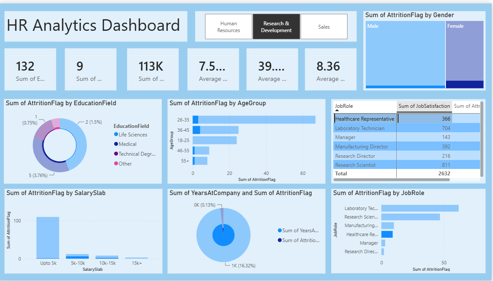

# HR-Analytics-Dashboard-Using-Power-BI

## Dashboard Preview

---

## Project Overview

This HR Analytics Dashboard was developed in Power BI to analyze employee attrition, workforce demographics, job satisfaction, salary distribution, and departmental trends.

---

## Objectives

- Analyze employee attrition.
- Identify departments with high attrition.
- Analyze salary slabs.
- Compare gender-wise attrition.
- Understand job satisfaction.
- Study employee age distribution.

---

## KPIs

- Total Employees
- Total Attrition
- Attrition Rate
- Average Salary
- Average Age
- Average Years at Company

---

## Tools Used

- Power BI
- Power Query
- DAX
- Microsoft Excel

---

## Dashboard Features

- Department Filter
- Gender Analysis
- Education Analysis
- Age Group Analysis
- Salary Slab Analysis
- Job Role Analysis
- Job Satisfaction Analysis

---

## Files

- HR_Analytics_Dashboard.pbix
- HR_Analytics.csv
- Dashboard.png

---

## Author

Kapil Kumar
